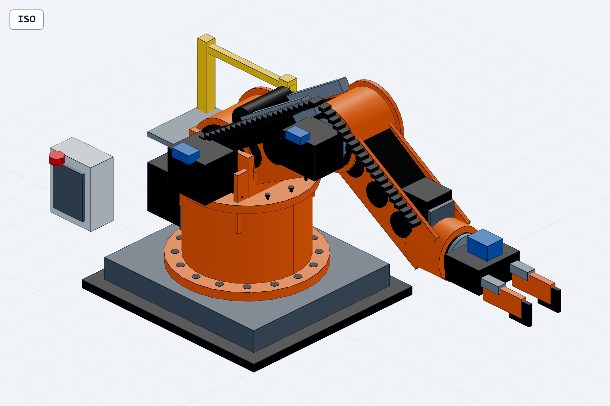
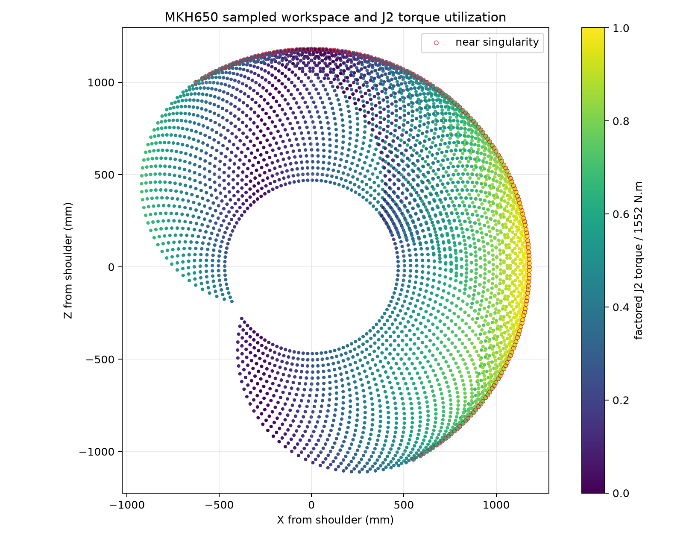
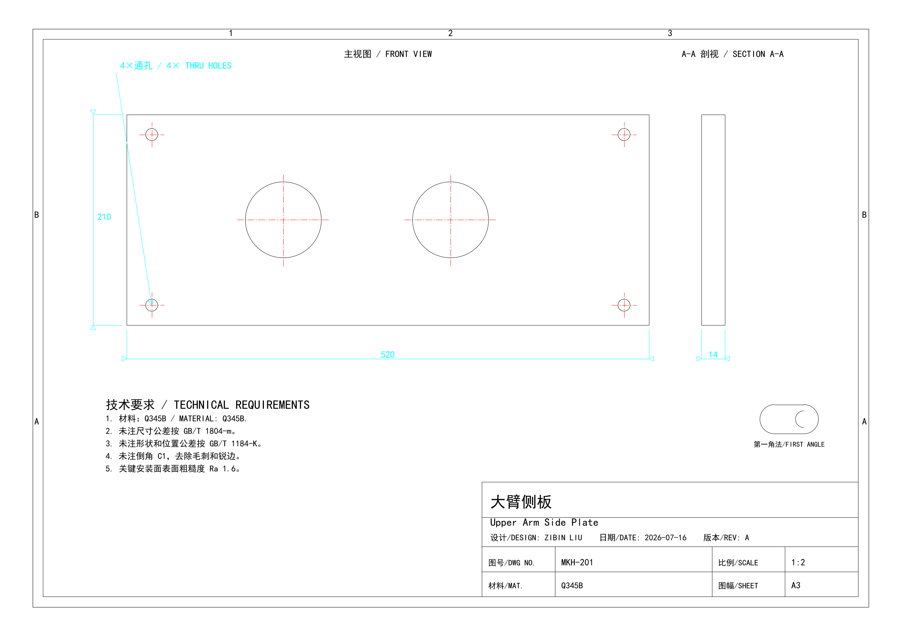

# MKH650 模块化四轴搬运机械手

20 kg额定负载、1180 mm最大工作半径的模块化四轴工业搬运机械手。本项目覆盖总体方案、关节传动、轴承与法兰接口、重载箱式连杆、夹紧力、制造装配和维护设计。

## 项目内容

- 16点基础锚固、J1回转支承和肩部塔架
- J2/J3减速器、轴承、中空轴和12点法兰接口
- 双侧板箱式大臂/小臂、横向筋板和检修结构
- 平衡机构、双段拖链和集中润滑接口
- J4腕部、重载平行夹爪及可更换夹持块
- 参数化整机、关键零件、工程图、BOM和制造计划

## 核心结果

| 项目 | 结果 |
|---|---:|
| 额定负载 | 20 kg |
| 最大工作半径 | 1180 mm |
| J2设计扭矩 | 1552 N·m |
| 姿态/载荷采样 | 4,453个姿态 |
| 大臂简化梁最大应力 | 19.24 MPa |
| 大臂简化梁最大挠度 | 0.153 mm |

## 可编辑交付物

- [详细参数化模型](models/mkh650_manipulator.py)及[整机STEP](models/mkh650_manipulator.step)
- `native_sources/solidworks/`：4个真实 SolidWorks 2023 `.SLDPRT`
- `native_sources/enhanced_key_parts/`：增强基础法兰、侧板、输出法兰和夹指
- `native_sources/production_parts_v2/`：J2中空轴、轴承端盖、肩部加强板和ISO 9409工具法兰
- `native_sources/production_parts_v3/`：J2电机转接法兰、平衡轴销、检修盖和拖链安装架
- `drawings/`：总装图及关键零件 DXF、PDF、PNG
- `native_sources/engineering_package/`：受控零件号、BOM、A3图纸和爆炸参考装配
- `native_sources/motion_validation/`：姿态、工作空间和J2载荷验证
- [工程项目书](MKH650-Modular-Manipulator_Engineering_Project_Book.pdf)

## 验证边界

仓库能够证明总体结构、轴系方案、参数化模型、关键工程图、BOM和初步强度逻辑。结构结果是整体梁有限元初筛，不代表孔边、焊缝、轴承座和螺栓连接的三维实体结果。当前详细 STEP 仍有需要在原生装配中分类处理的实体交叠，动态性能、额定寿命和实际搬运节拍也需要后续求解或样机验证。

简历证据入口见 [`resume_evidence/README.md`](resume_evidence/README.md)，原生格式状态见 [`native_sources/native_format_status/`](native_sources/native_format_status/)。

采购询价接口和动态/寿命复核项见 [`docs/procurement_interface_freeze.csv`](docs/procurement_interface_freeze.csv)。
